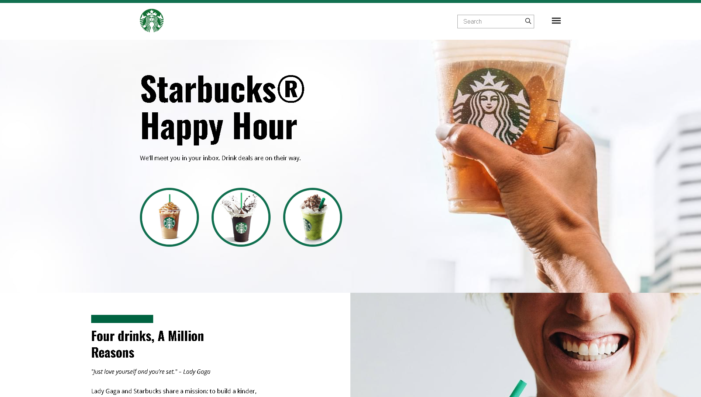

# ☕ Starbucks Landing Page

Projeto de landing page inspirado no site da Starbucks, desenvolvido como parte dos exercícios do curso da **B7Web**, com aprimoramentos próprios para praticar **CSS Grid**, **Flexbox** e **responsividade**.

  

---

## 📚 Tecnologias utilizadas

- HTML5
- CSS3
- Google Fonts 

---

## 🎯 Objetivos do projeto

- Praticar **CSS Grid** para organizar áreas do layout em colunas e linhas
- Usar **Flexbox** para alinhar itens em seções como o cabeçalho
- Aplicar **responsividade** para diversos tamanhos de tela
- Trabalhar com imagens de fundo, posicionamento e adaptação fluida
- Usar boas práticas de estruturação HTML e organização de CSS

---

## 🧪 Status

✔️ Projeto finalizado e funcional  
🛠️ Aberto para melhorias futuras como animações, interatividade ou transições suaves

---

## 👨‍💻 Autor

Desenvolvido por **Tiago Lima**  
[🔗 Meu GitHub](https://github.com/ti-limaa)

---

